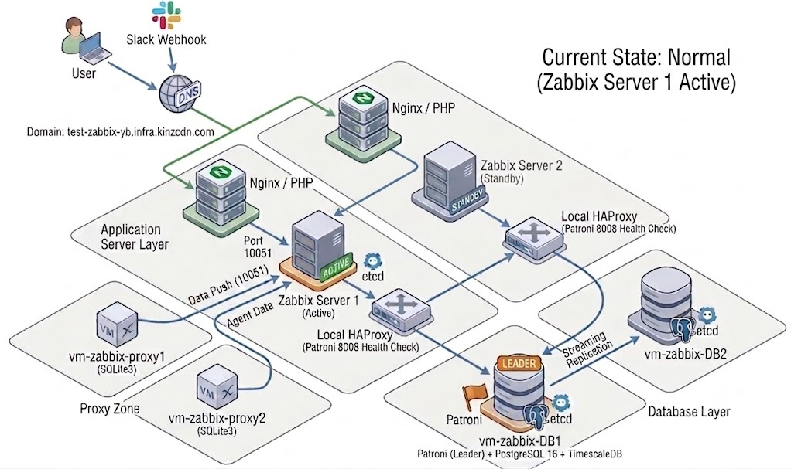
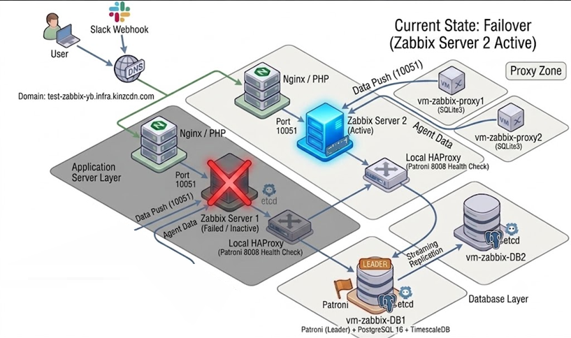

# 🚀 Enterprise Zabbix 7.0 High Availability (HA) Infrastructure

> **단일 장애점(SPOF)을 배제한 Zabbix 7.0 모니터링 인프라 구축 프로젝트**

---

## 📌 1. 프로젝트 개요 (Project Overview)

본 프로젝트는 대규모 모니터링 환경에서 특정 서버, DB, 네트워크 장비가 다운되더라도 **24/7 중단 없는 모니터링 및 알림 연동**을 유지하기 위한 **고가용성(HA) 인프라 구축**을 목적으로 진행되었습니다.

- **목표:** 전 계층(Web, App, DB, Proxy)에 대한 자동 장애 조치(Failover) 및 부하 분산 구현
- **주요 구성:** Zabbix 7.0 Native HA + Patroni (PostgreSQL 16 + TimescaleDB) + etcd Quorum + Local HAProxy + Zabbix Proxy Group

---

## 📐 2. 아키텍처 다이어그램 (Architecture Diagram)

