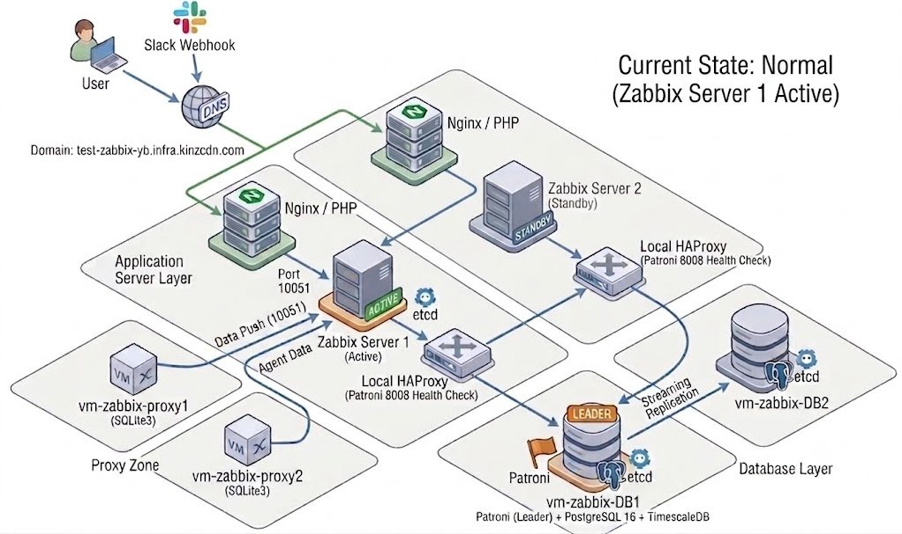
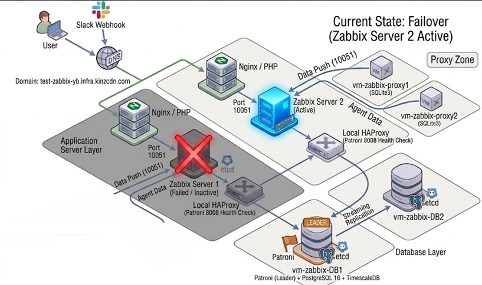

# Zabbix 7.0.29 HA 통합 모니터링 인프라


Zabbix 6.0과 Nagios로 분리되어 있던 모니터링 환경을 **Zabbix 7.0.29 LTS 기반 단일 플랫폼**으로 통합하고, Server·Database·Proxy 계층을 이중화한 프로젝트입니다. PostgreSQL 16과 TimescaleDB로 시계열 데이터 처리 기반을 개선했으며, Patroni·etcd·HAProxy를 조합해 쓰기 가능한 Primary DB로 자동 연결되도록 구성했습니다.

> 이 저장소의 주소·계정·비밀번호는 `<MASKED_...>` 형태로 비식별화되어 있습니다. 배포 전에 환경별 값으로 교체하고 비밀정보는 Git이 아닌 Vault, systemd credential, Ansible Vault 등의 별도 저장소에서 관리하세요.

## 목차

- [프로젝트 개요](#프로젝트-개요)
- [아키텍처](#아키텍처)
- [주요 성과](#주요-성과)
- [저장소 구성](#저장소-구성)
- [구축 및 포팅 매뉴얼](#구축-및-포팅-매뉴얼)
  - [IXcloud 보안그룹](#2-1-ixcloud-보안그룹-구성)
- [Zabbix 및 Nagios 마이그레이션](#zabbix-및-nagios-마이그레이션)
- [부하 테스트](#부하-테스트)
- [Failover 검증](#failover-검증)
- [트러블슈팅](#트러블슈팅)
- [운영·보안 체크리스트](#운영보안-체크리스트)

## 프로젝트 개요

| 구분 | 내용 |
| --- | --- |
| 프로젝트명 | Zabbix 7.0.29 기반 통합 모니터링 시스템 구축 및 Nagios 마이그레이션 |
| 수행 기간 | 2026.07.15 ~ 2026.08.05 |
| 기존 환경 | Zabbix 6.0 LTS, MySQL 8.0, Zabbix Agent, Nagios, 단일 VM 중심 구성 |
| 개선 환경 | Zabbix 7.0.29 LTS, PostgreSQL 16, TimescaleDB, Agent 2, Patroni, etcd, HAProxy, Proxy Group |
| 수행 범위 | 아키텍처 설계, 구축·업그레이드, Nagios 항목 분석·이관, 외부검사 개발, 부하 및 Failover 테스트, 문서화 |
| 핵심 목표 | 플랫폼 단일화, 계층별 SPOF 축소, 장애 대응 자동화, 시계열 데이터 확장성 확보 |

기존 환경에서는 동일한 호스트와 검사 항목을 Zabbix와 Nagios에서 중복 관리하고, 알림·임계치·장애 대응 기준도 플랫폼별로 운영해야 했습니다. 본 프로젝트에서는 호스트명과 IP를 함께 대조해 대상을 정규화하고, HTTP·SSL·ICMP는 Zabbix 기본 기능으로, DNS·RTMP는 External Check로 이관했습니다.

## 아키텍처





```text
Internal users
    │ http://test-zabbix-yb.infra.kinxcdn.com/zabbix
    ▼
In-house traffic distribution appliance
    ├─ Server 1 Nginx / PHP frontend
    └─ Server 2 Nginx / PHP frontend

Monitoring targets
    │ Agent 2 / SNMP / ICMP / HTTP / External Check
    ▼
Zabbix Proxy Group
    ├─ Proxy 1 (active mode, SQLite)
    └─ Proxy 2 (active mode, SQLite)
    │
    ▼
Zabbix Server Native HA
    ├─ Server 1 (Active 또는 Standby)
    └─ Server 2 (Active 또는 Standby)
    │ 127.0.0.1:5432
    ▼
Local HAProxy on each server
    │ Patroni REST API /primary health check
    ▼
PostgreSQL 16 + TimescaleDB
    ├─ DB1 (Primary 또는 Replica)
    └─ DB2 (Primary 또는 Replica)
       └─ Patroni + 3-node etcd quorum
```

### 노드 역할

| 계층 | 호스트명 | 주요 역할 |
| --- | --- | --- |
| Web / App 1 | `vm-zabbix-server1` | Nginx, PHP 8.3, Zabbix Server, Local HAProxy, etcd member 3 |
| Web / App 2 | `vm-zabbix-server2` | Nginx, PHP 8.3, Zabbix Server, Local HAProxy |
| Database 1 | `vm-zabbix-db1` | PostgreSQL 16, TimescaleDB, Patroni, etcd member 1 |
| Database 2 | `vm-zabbix-db2` | PostgreSQL 16, TimescaleDB, Patroni, etcd member 2 |
| Proxy 1 | `vm-zabbix-proxy1` | Zabbix Proxy active mode, SQLite, Proxy Group member |
| Proxy 2 | `vm-zabbix-proxy2` | Zabbix Proxy active mode, SQLite, Proxy Group member |

### 계층별 고가용성

- **Zabbix Server:** 두 서버가 같은 DB를 사용하며 한 노드만 Active로 동작합니다. Active 노드의 heartbeat가 끊기면 Standby가 자동 승격됩니다.
- **Database:** Patroni가 etcd의 분산 상태를 기준으로 Primary를 선출하고 PostgreSQL Streaming Replication을 관리합니다.
- **DB 연결:** 각 Zabbix Server의 Local HAProxy가 Patroni `/primary` API에서 HTTP 200을 반환하는 노드에만 DB 연결을 전달합니다.
- **Proxy:** Zabbix 7.0.29 Proxy Group이 수집 부하를 분산하며 장애 Proxy의 호스트를 생존 Proxy로 재할당합니다.
- **Web frontend:** 사내 트래픽 분산 장비가 `http://test-zabbix-yb.infra.kinxcdn.com/zabbix` 요청을 Server1·Server2의 Nginx/PHP frontend로 전달합니다. 따라서 Keepalived VIP는 사용하지 않습니다.
- **Frontend와 Zabbix Server HA 연동:** 두 frontend 모두 `$ZBX_SERVER`를 고정하지 않아 DB의 HA 노드 정보를 바탕으로 현재 Active Zabbix Server를 찾습니다. Web 요청 분산과 Zabbix Server Active/Standby 절체는 서로 다른 계층에서 처리됩니다.

## 주요 성과

| 검증 항목 | 결과 |
| --- | ---: |
| Nagios 전수 비교 대상 | 259 hosts |
| 부하 테스트 대상 | 2,000 dummy hosts |
| Host당 Item / Trigger | 25 / 25 |
| 전체 Item | 약 50,000 |
| 수집 주기 | 10초 |
| 목표 수집량 | 약 5,000 NVPS |
| DB Failover 연결 복구 | 18.62초 |
| Zabbix Server Active 승격 | 2.55초 |
| Zabbix Server 전체 서비스 복구 | 6.61초 |
| Proxy 장애 감지 | 63.35초 |
| Proxy Host 이관 완료 | 70.77초 |

데이터 손실 수치는 테스트 로그와 History 저장 결과에서 **관찰되지 않은 범위**를 의미합니다. 비정상 전원 차단, 네트워크 분할, 동기 복제 설정 등 모든 장애 조건에서의 절대적인 RPO 0을 보장하는 표현은 아닙니다.

## 저장소 구성

```text
zabbix-ha-infrastructure/
├─ HAproxy/
│  └─ haproxy.cfg                 # Patroni Primary 기반 DB 라우팅
├─ Nginx/
│  └─ zabbix.conf                 # Zabbix Web frontend
├─ patroni/
│  ├─ DB1_patroni.yml             # DB1 Patroni 설정
│  └─ DB2_patroni.yml             # DB2 Patroni 설정
├─ Zabbix/
│  ├─ README.md                   # Zabbix HA 구성 및 상세 포팅 Runbook
│  ├─ zabbix_server.conf          # Zabbix Server Native HA 설정
│  ├─ zabbix_proxy.conf           # Active Proxy·SQLite 설정
│  ├─ zabbix_agent2.conf          # Agent 2 Active/Passive 설정
│  ├─ zabbix.conf.php             # Web frontend DB/HA 설정
│  ├─ DNS_Check.sh                # DNS External Check 예제와 설치 메모
│  └─ RTMP_Check.sh               # RTMP External Check 예제와 설치 메모
├─ Load_Test/
│  ├─ create_hosts.py             # Dummy host 생성
│  ├─ add_triggers.py             # Trigger 생성
│  ├─ load_generator.py           # zabbix_sender 부하 생성
│  └─ delete_hosts.py             # Dummy host 정리
├─ docs/                          # 발표·보고 자료
├─ AD1.png
├─ AD2.png
└─ README.md                      # 프로젝트 전체 개요
```

### Zabbix 배포 파일

| 파일 | 배포 대상 | 용도 |
| --- | --- | --- |
| [`Zabbix/README.md`](Zabbix/README.md) | 구축·운영 담당자 | Zabbix HA 상세 구성과 포팅 Runbook |
| [`Zabbix/zabbix_server.conf`](Zabbix/zabbix_server.conf) | Server1, Server2 | Local HAProxy DB 연결과 Zabbix Native HA 설정 |
| [`Zabbix/zabbix_proxy.conf`](Zabbix/zabbix_proxy.conf) | Proxy1, Proxy2 | Active Proxy, SQLite, HA Server 순차 접속 설정 |
| [`Zabbix/zabbix_agent2.conf`](Zabbix/zabbix_agent2.conf) | 6개 노드 및 모니터링 대상 | Passive 허용 대상과 Active 목적지 설정 |
| [`Zabbix/zabbix.conf.php`](Zabbix/zabbix.conf.php) | Server1, Server2 | Web frontend의 PostgreSQL/HA 연결 설정 |
| [`Zabbix/DNS_Check.sh`](Zabbix/DNS_Check.sh) | 검사를 실행하는 Proxy/Server | DNS External Check 예제와 설치 메모 |
| [`Zabbix/RTMP_Check.sh`](Zabbix/RTMP_Check.sh) | 검사를 실행하는 Proxy/Server | RTMP External Check 예제와 설치 메모 |
| [`patroni/DB1_patroni.yml`](patroni/DB1_patroni.yml) | DB1 | DB1 Patroni·etcd·PostgreSQL 설정 |
| [`patroni/DB2_patroni.yml`](patroni/DB2_patroni.yml) | DB2 | DB2 Patroni·etcd·PostgreSQL 설정 |
| [`HAproxy/haproxy.cfg`](HAproxy/haproxy.cfg) | Server1, Server2 | Patroni `/primary` 기반 DB 라우팅 |
| [`Nginx/zabbix.conf`](Nginx/zabbix.conf) | Server1, Server2 | `/zabbix` Web frontend 설정 |

> `DNS_Check.sh`와 `RTMP_Check.sh`는 실행 스크립트 앞뒤에 설치 명령이 포함된 Runbook 형식입니다. 파일 전체를 ExternalScripts 디렉터리에 복사하지 말고 `#!/bin/bash`부터 검사 로직까지만 각각 `check_dns.sh`, `check_rtmp.sh`로 분리해 배포합니다.

## 구축 및 포팅 매뉴얼

이 절차는 Ubuntu 24.04 계열 Linux와 systemd를 기준으로 하며, [`Zabbix/README.md`](Zabbix/README.md)의 최종 구성과 포팅 절차를 저장소 루트 기준 경로로 정리한 것입니다. 상세한 검증 범위, 시행착오에서 제외한 절차, 보안 주의사항은 해당 문서를 함께 확인합니다.

### 포팅 전 준비

#### 1. 환경값

다음 값을 먼저 확정하고 저장소의 `<MASKED_...>`를 환경별 값으로 교체합니다.

```text
<DB1_IP>        <DB2_IP>
<SERVER1_IP>    <SERVER2_IP>
<PROXY1_IP>     <PROXY2_IP>
<SERVICE_CIDR>  <ADMIN_CIDR>

<DB_PASSWORD>
<POSTGRES_SUPERUSER_PASSWORD>
<REPLICATION_PASSWORD>
<MONITOR_PASSWORD>
```

비밀번호를 셸 명령에 직접 넣으면 history와 프로세스 목록에 남을 수 있습니다. 배포 자동화의 secret store, 권한이 제한된 `.pgpass`, `psql`의 `\password` 등을 사용합니다.

#### 2. 네트워크

| Port | Source → Destination | 용도 |
| ---: | --- | --- |
| 80/443 | 사용자/분산 장비 → Server | Web UI |
| 10050/TCP | Server/Proxy → Agent | Passive Check |
| 10051/TCP | Proxy/Active Agent → Server | Active Proxy·Agent, trapper |
| 5432/TCP | Server → Local HAProxy, DB peer | PostgreSQL 및 복제 |
| 8008/TCP | Server HAProxy → DB | Patroni REST health check |
| 2379/TCP | Patroni → etcd members | etcd client |
| 2380/TCP | etcd member ↔ member | etcd peer |

`2379`, `2380`, `8008`, `5432`, `10051`은 필요한 내부 노드와 서비스망으로 source를 제한합니다. 인터넷 전체에 열지 않습니다.

##### 2-1. IXcloud 보안그룹 구성

이 프로젝트는 **IXcloud**의 세 보안그룹을 DB, Proxy, Server 인스턴스에 각각 연결합니다. 아래 표는 실제 구축 규칙을 최소 권한 관점에서 다시 정리한 권장안입니다.

```text
DB1      192.168.20.10      Server1   192.168.20.23
DB2      192.168.20.28      Server2   192.168.20.5
Proxy1   192.168.20.8       Proxy2    192.168.20.15
Admin    1.201.194.32/32    Service network 192.168.20.0/24
```

IXcloud 콘솔에서 하나의 규칙에 여러 source CIDR을 입력할 수 없다면 표의 쉼표로 나열한 주소마다 규칙을 한 개씩 생성합니다. Source Security Group 참조 기능을 사용할 수 있는 프로젝트라면 고정 IP `/32` 대신 상대 보안그룹을 지정하는 편이 인스턴스 교체에 유리합니다.

> 이 정책은 일반적인 OpenStack 계열 Security Group처럼 연결 추적이 적용되는 **stateful 동작**을 전제로 합니다. 송신 요청에 대한 응답 패킷은 별도 수신 규칙 없이 허용됩니다. IXcloud 프로젝트의 실제 동작과 별도 Network ACL 적용 여부를 콘솔 또는 기술지원으로 확인한 후 운영에 반영하세요.

###### `sg-zabbix-db`

DB1과 DB2에 연결합니다.

| 방향 | Ether | 프로토콜 | 포트 범위 | 트래픽 Source/Destination | 설명 |
| --- | --- | --- | --- | --- | --- |
| 수신 | IPv4 | TCP | 22 | `1.201.194.32/32` | 관리 NAT에서 SSH |
| 수신 | IPv4 | TCP | 10050 | `192.168.20.23/32`, `192.168.20.5/32` | Server1·Server2의 DB Agent passive check |
| 수신 | IPv4 | TCP | 2379 | `192.168.20.10/32`, `192.168.20.28/32`, `192.168.20.23/32` | Patroni와 etcd client 통신 |
| 수신 | IPv4 | TCP | 2380 | `192.168.20.10/32`, `192.168.20.28/32`, `192.168.20.23/32` | 세 etcd member 간 peer 통신 |
| 수신 | IPv4 | TCP | 8008 | `192.168.20.23/32`, `192.168.20.5/32` | 두 Local HAProxy의 Patroni `/primary` health check |
| 수신 | IPv4 | TCP | 5432 | `192.168.20.23/32`, `192.168.20.5/32`, `192.168.20.10/32`, `192.168.20.28/32` | Zabbix Server DB 연결과 DB 간 Streaming Replication |
| 송신 | IPv4 | ALL | ALL | `0.0.0.0/0` | 패키지 설치, DNS/NTP 및 HA 구성 통신을 포함한 현재 운영 정책 |

정리한 내용:

- etcd `2379/2380`과 Patroni `8008`의 source를 `192.168.20.0/24` 전체에서 실제 구성 노드로 축소했습니다.
- PostgreSQL `5432`의 중복 규칙은 하나의 논리 항목으로 합쳤습니다. IXcloud 콘솔에는 source별 `/32` 규칙으로 등록합니다.
- `IPv4 ALL` 송신이 Metadata IP를 포함하므로 `TCP/80 → 169.254.169.254/32` 규칙은 중복이라 별도로 두지 않습니다.
- IPv6 주소와 서비스가 없으므로 `IPv6 ALL` 송신은 제거합니다. IPv6를 활성화할 때 필요한 목적지 기준으로 다시 설계합니다.

###### `sg-zabbix-proxy`

Proxy1과 Proxy2에 연결합니다.

| 방향 | Ether | 프로토콜 | 포트 범위 | 트래픽 Source/Destination | 설명 |
| --- | --- | --- | --- | --- | --- |
| 수신 | IPv4 | TCP | 22 | `1.201.194.32/32` | 관리 NAT에서 SSH |
| 수신 | IPv4 | TCP | 10050 | `192.168.20.23/32`, `192.168.20.5/32` | Server1·Server2의 Proxy Agent passive check |
| 수신 | IPv4 | TCP | 10051 | `<MONITORED_TARGET_CIDRS>` | Agent active check와 `zabbix_sender` 데이터 수신 |
| 수신 | IPv4 | TCP | 10051 | `<LOAD_GENERATOR_CIDRS>` | 부하 테스트 기간에만 추가하고 테스트 후 삭제 |
| 송신 | IPv4 | ALL | ALL | `0.0.0.0/0` | Zabbix Server 연결과 SNMP·ICMP·HTTP·DNS·RTMP 검사 대상 접근 |

`10051/TCP`의 source를 `ALL`로 공개하면 임의의 시스템이 Proxy trapper/active check 포트에 접근할 수 있습니다. 실제 Agent가 위치한 서비스 CIDR, 지점망, VPN 대역 또는 별도 모니터링 Security Group으로 제한합니다. 인터넷상의 동적 대상 때문에 제한이 불가능하다면 TLS PSK/certificate와 host firewall을 함께 적용하고 접근 로그를 모니터링합니다.

Active Proxy는 Server로 먼저 연결하므로 Server가 Proxy의 `10051`에 접속하기 위한 별도 수신 규칙은 필요하지 않습니다. Passive Proxy로 변경할 경우에만 Server1·Server2를 source로 하는 `10051/TCP` 규칙을 추가합니다.

###### `sg-zabbix-server`

Server1과 Server2에 연결합니다.

| 방향 | Ether | 프로토콜 | 포트 범위 | 트래픽 Source/Destination | 설명 |
| --- | --- | --- | --- | --- | --- |
| 수신 | IPv4 | TCP | 22 | `1.201.194.32/32` | 관리 NAT에서 SSH |
| 수신 | IPv4 | TCP | 80 | `1.201.194.30/32`, `1.201.194.32/32`, `192.168.20.0/24` | 사내 NAT와 내부망의 Zabbix Web 접속 |
| 수신 | IPv4 | TCP | 10050 | `192.168.20.23/32`, `192.168.20.5/32` | 두 Server 노드의 Agent passive check |
| 수신 | IPv4 | TCP | 10051 | `192.168.20.8/32`, `192.168.20.15/32`, `192.168.20.23/32`, `192.168.20.5/32` | Proxy1·Proxy2 및 Server Agent의 Active Server 연결 |
| 수신 | IPv4 | TCP | 2379 | `192.168.20.10/32`, `192.168.20.28/32`, `192.168.20.23/32` | Server1의 etcd client endpoint |
| 수신 | IPv4 | TCP | 2380 | `192.168.20.10/32`, `192.168.20.28/32`, `192.168.20.23/32` | Server1과 DB1·DB2 etcd peer 통신 |
| 송신 | IPv4 | ALL | ALL | `0.0.0.0/0` | DB·Proxy·Agent 연결, 외부검사, 알림, 패키지 설치와 DNS/NTP |

`10051/TCP`를 통해 Server에 직접 접속하는 별도 Agent 또는 sender가 있다면 해당 source CIDR만 추가합니다. 모든 모니터링 대상을 Proxy Group으로 전환했다면 Proxy1·Proxy2만 허용하고 Server Agent가 실제로 active mode를 사용할 때만 Server1·Server2 source를 유지합니다.

기존 Server 보안그룹의 여러 외부 IP별 ICMP 수신 규칙은 제거합니다. Zabbix Server가 외부 대상으로 ICMP echo request를 보내는 구조에서는 stateful SG가 reply를 자동 허용하므로 대상별 수신 규칙이 필요하지 않습니다. 반대로 외부 모니터링 시스템이 Zabbix Server 자체를 ping해야 한다면 그 모니터링 시스템의 source CIDR만 별도 허용합니다.

Web UI는 운영 시 HTTPS를 권장합니다. 인증서를 적용한 뒤 동일 source에 `443/TCP`를 허용하고, `80/TCP`는 HTTPS redirect 용도로만 유지하거나 폐쇄합니다.

###### 공통 Egress 정책

현재 구성은 External Check, Slack/Webhook, package repository 등 목적지가 다양하므로 세 보안그룹 모두 `IPv4 ALL → 0.0.0.0/0` 송신을 유지하는 운영 우선 정책입니다. 따라서 다음 규칙은 중복 또는 미사용으로 제외합니다.

- `TCP/80 → 169.254.169.254/32`: IPv4 ALL 송신에 이미 포함됨
- `IPv6 ALL → ALL`: 현재 IPv6 주소와 서비스가 없으면 불필요
- ICMP reply용 개별 수신 규칙: stateful 연결 추적에서 불필요

더 엄격한 egress 통제가 필요하면 `IPv4 ALL`을 제거한 뒤 다음 목적지를 명시적으로 허용해야 합니다.

- IXcloud Metadata: `169.254.169.254/32 TCP/80`
- 내부 DNS: `TCP/UDP 53`, NTP: `UDP 123`
- Ubuntu·Zabbix·PostgreSQL·TimescaleDB 저장소: `TCP 80/443`
- DB/etcd/Patroni/Zabbix 통신: 위 역할별 내부 IP와 포트
- Slack/Webhook, SMTP, DNS·RTMP·HTTP 검사 대상: 실제 목적지와 포트

#### 3. 공통 사전 점검

```bash
timedatectl status
hostnamectl
getent hosts <DB1_HOST> <DB2_HOST> <SERVER1_HOST> <SERVER2_HOST>
ip -br address
```

모든 노드의 시간 동기화와 이름 해석이 정상이어야 합니다. 기존 환경을 포팅한다면 다음 항목을 별도 백업합니다.

- 기존 Zabbix DB와 VM/Snapshot
- Zabbix Template, Host Group, Host, Action, Media Type export
- `/etc/zabbix`, Nginx, PHP, HAProxy 설정
- External Check와 사용자 매크로
- Nagios Host/Service 정의 및 알림 임계치

### 포팅 순서

권장 순서는 `공통 저장소 → etcd → DB/Patroni → DB 초기화 → HAProxy → Zabbix Server/Web → Proxy → Agent 2/External Check → UI 이관`입니다.

#### 1. Zabbix 공식 저장소 등록

Ubuntu 24.04용 Zabbix 7.0 LTS 저장소를 모든 Zabbix 구성 노드에 등록한 뒤 Candidate 버전을 확인합니다.

```bash
sudo apt update
sudo apt install -y wget ca-certificates gnupg

wget -O /tmp/zabbix-release.deb \
  https://repo.zabbix.com/zabbix/7.0/ubuntu/pool/main/z/zabbix-release/zabbix-release_latest_7.0+ubuntu24.04_all.deb
sudo dpkg -i /tmp/zabbix-release.deb
sudo apt update

apt-cache policy zabbix-server-pgsql zabbix-proxy-sqlite3 zabbix-agent2
apt-cache madison zabbix-server-pgsql
```

이 프로젝트의 목표 패치는 `1:7.0.29-1+ubuntu24.04`입니다. 저장소에서 제공되는지 확인한 뒤 Server, Proxy, Agent, SQL scripts를 가능한 한 같은 패치 버전으로 설치합니다.

#### 2. etcd 3-node quorum 구성

DB1, DB2, Server1에 etcd를 설치합니다.

```bash
sudo apt install -y etcd-server etcd-client
sudo systemctl stop etcd
```

각 노드의 `/etc/default/etcd`에 고유 이름과 주소를 설정합니다. 아래 예시는 DB1 기준이며 DB2와 Server1에서는 이름·로컬 주소만 바꿉니다.

```bash
ETCD_NAME=db1
ETCD_DATA_DIR=/var/lib/etcd/db1.etcd
ETCD_LISTEN_PEER_URLS=http://<DB1_IP>:2380
ETCD_LISTEN_CLIENT_URLS=http://127.0.0.1:2379,http://<DB1_IP>:2379
ETCD_INITIAL_ADVERTISE_PEER_URLS=http://<DB1_IP>:2380
ETCD_ADVERTISE_CLIENT_URLS=http://<DB1_IP>:2379
ETCD_INITIAL_CLUSTER=db1=http://<DB1_IP>:2380,db2=http://<DB2_IP>:2380,server1=http://<SERVER1_IP>:2380
ETCD_INITIAL_CLUSTER_TOKEN=zabbix-ha-etcd
ETCD_INITIAL_CLUSTER_STATE=new
```

세 노드 설정을 모두 배포한 뒤 서비스를 시작합니다.

```bash
sudo systemctl enable --now etcd

export ETCDCTL_API=3
etcdctl \
  --endpoints=http://<DB1_IP>:2379,http://<DB2_IP>:2379,http://<SERVER1_IP>:2379 \
  endpoint health
etcdctl \
  --endpoints=http://<DB1_IP>:2379,http://<DB2_IP>:2379,http://<SERVER1_IP>:2379 \
  endpoint status --write-out=table
```

기존 etcd 클러스터에 새 노드를 포팅하는 경우 `ETCD_INITIAL_CLUSTER_STATE=existing`을 사용하고 `etcdctl member add` 결과의 설정을 따릅니다. 기존 data directory나 DCS prefix를 임의로 삭제하지 않습니다.

#### 3. PostgreSQL 16, TimescaleDB, Patroni 설치

DB1과 DB2에 PostgreSQL 16·TimescaleDB 저장소를 OS에 맞게 등록한 후 설치합니다.

```bash
sudo apt update
sudo apt install -y \
  postgresql-16 postgresql-client-16 \
  timescaledb-2-postgresql-16 \
  patroni python3-psycopg2

sudo systemctl disable --now postgresql
```

Patroni가 PostgreSQL 프로세스를 직접 소유하므로 기본 `postgresql.service`를 다시 활성화하지 않습니다. `timescaledb-tune`이 `/etc/postgresql/16/main/postgresql.conf`에 쓴 값은 Patroni DCS에 자동 반영되지 않으므로 이 매뉴얼에서는 자동 실행하지 않습니다.

##### Greenfield data directory 준비

패키지 설치로 만들어진 기본 cluster가 실제 데이터를 포함하지 않는 새 구축 대상인지 확인합니다.

```bash
sudo -u postgres pg_controldata /var/lib/postgresql/16/main | head
sudo du -sh /var/lib/postgresql/16/main
```

Patroni bootstrap에는 비어 있는 `data_dir`가 필요합니다. 기존 운영 데이터가 있다면 삭제하지 말고 DB 백업·복구 또는 별도 data directory를 설계합니다. 새 cluster임이 확인된 경우에도 기존 디렉터리를 바로 삭제하지 말고 timestamp를 붙여 보관한 뒤 빈 디렉터리를 준비합니다.

```bash
sudo mv /var/lib/postgresql/16/main /var/lib/postgresql/16/main.pre-patroni
sudo install -d -o postgres -g postgres -m 0700 /var/lib/postgresql/16/main
```

##### Patroni 설정 배포

DB1과 DB2에 각각의 파일을 배포하고 placeholder를 교체합니다.

```bash
# DB1
sudo install -d -o postgres -g postgres -m 0750 /etc/patroni
sudo install -o postgres -g postgres -m 0640 \
  patroni/DB1_patroni.yml /etc/patroni/patroni.yml

# DB2에서는 DB2_patroni.yml 사용
```

배포 전에 다음 항목을 반드시 확인합니다.

- 두 파일의 `scope`와 `namespace`는 동일하고 `name`은 각각 `db1`, `db2`
- `etcd3.hosts`에 DB1, DB2, Server1의 세 endpoint가 존재
- `restapi.listen`, `connect_address`, `postgresql.connect_address`는 해당 노드 IP
- `pg_hba`의 subnet은 실제 서비스망으로 제한
- replication, superuser, Zabbix 계정의 비밀번호 교체
- `shared_preload_libraries: 'timescaledb'` 유지

배포판의 Patroni unit이 `/etc/patroni/config.yml`을 요구한다면 현재 표준 파일을 가리키는 심볼릭 링크를 만듭니다.

```bash
systemctl cat patroni | grep -E 'ExecStart|Environment'
sudo ln -sfn /etc/patroni/patroni.yml /etc/patroni/config.yml
```

DB1을 먼저 시작하고 Leader가 된 것을 확인한 다음 DB2를 시작합니다.

```bash
# DB1
sudo systemctl enable --now patroni
sudo patronictl -c /etc/patroni/patroni.yml list

# DB1이 Leader가 된 뒤 DB2
sudo systemctl enable --now patroni
sudo patronictl -c /etc/patroni/patroni.yml list
```

정상 상태는 DB 한 대가 `Leader`, 다른 한 대가 `Replica`이며 Replica의 lag가 수렴하는 상태입니다.

#### 4. Zabbix DB와 TimescaleDB schema 초기화

DB1/DB2 중 현재 Patroni Leader에서만 계정과 DB를 생성합니다. 아래 SQL의 비밀번호는 실제 secret 관리 방식에 맞게 입력합니다.

```sql
CREATE USER zabbix WITH PASSWORD '<DB_PASSWORD>';
CREATE DATABASE zabbix OWNER zabbix;

CREATE USER zbx_monitor WITH PASSWORD '<MONITOR_PASSWORD>';
GRANT pg_read_all_stats TO zbx_monitor;
```

```bash
sudo -u postgres psql -d zabbix \
  -c 'CREATE EXTENSION IF NOT EXISTS timescaledb CASCADE;'
```

Server1에 `zabbix-sql-scripts`를 설치한 뒤 schema는 한 번만 import합니다. HAProxy가 아직 준비되지 않았다면 현재 Leader 주소로 연결하고, 준비됐다면 `127.0.0.1`을 사용합니다.

```bash
sudo apt install -y zabbix-sql-scripts postgresql-client-16

zcat /usr/share/zabbix-sql-scripts/postgresql/server.sql.gz | \
  psql -h <CURRENT_PRIMARY_IP> -U zabbix -d zabbix

psql -h <CURRENT_PRIMARY_IP> -U zabbix -d zabbix \
  -f /usr/share/zabbix-sql-scripts/postgresql/timescaledb/schema.sql
```

```bash
sudo -u postgres psql -d zabbix \
  -c "SELECT extname, extversion FROM pg_extension WHERE extname='timescaledb';"
sudo -u postgres psql -d zabbix \
  -c 'SELECT hypertable_name FROM timescaledb_information.hypertables;'
```

#### 5. Local HAProxy 구성

Server1과 Server2에 동일하게 설치하고 설정합니다.

```bash
sudo apt install -y haproxy postgresql-client-16
sudo install -o root -g root -m 0644 \
  HAproxy/haproxy.cfg /etc/haproxy/haproxy.cfg
```

`db1`, `db2` backend의 주소와 Patroni port `8008`을 교체한 뒤 검증합니다.

```bash
sudo haproxy -c -f /etc/haproxy/haproxy.cfg
sudo systemctl enable --now haproxy

curl -i http://<DB1_IP>:8008/primary
curl -i http://<DB2_IP>:8008/primary
psql -h 127.0.0.1 -U zabbix -d zabbix -c 'SELECT pg_is_in_recovery();'
```

두 Patroni endpoint 중 현재 Primary만 `/primary`에 200을 반환해야 하며, Local HAProxy를 통한 쿼리는 `false`를 반환해야 합니다.

#### 6. Zabbix Server와 Web Frontend 구성

Server1과 Server2에 설치합니다.

```bash
ZBX_VERSION='1:7.0.29-1+ubuntu24.04'

sudo apt install -y \
  zabbix-server-pgsql="$ZBX_VERSION" \
  zabbix-frontend-php="$ZBX_VERSION" \
  zabbix-nginx-conf="$ZBX_VERSION" \
  zabbix-sql-scripts="$ZBX_VERSION" \
  zabbix-agent2="$ZBX_VERSION" \
  zabbix-get="$ZBX_VERSION" \
  zabbix-sender="$ZBX_VERSION" \
  php8.3-pgsql fping

sudo systemctl stop zabbix-server
```

Candidate에 해당 버전이 없다면 다른 release의 파일명을 추측하지 말고 `apt-cache madison` 결과에서 모든 역할에 공통으로 제공되는 7.0 LTS 패치를 선택합니다.

설정을 배포합니다.

```bash
sudo install -o root -g zabbix -m 0640 \
  Zabbix/zabbix_server.conf /etc/zabbix/zabbix_server.conf
sudo install -o www-data -g www-data -m 0640 \
  Zabbix/zabbix.conf.php /etc/zabbix/web/zabbix.conf.php
sudo install -o root -g root -m 0644 \
  Nginx/zabbix.conf /etc/nginx/conf.d/zabbix.conf
sudo rm -f /etc/nginx/sites-enabled/default
```

노드별로 다음 값을 다르게 지정합니다.

```ini
# Server1
HANodeName=server1
NodeAddress=<SERVER1_IP>:10051

# Server2
HANodeName=server2
NodeAddress=<SERVER2_IP>:10051
```

공통 설정은 Local HAProxy를 바라봅니다.

```ini
DBHost=127.0.0.1
DBPort=5432
DBName=zabbix
DBUser=zabbix
DBPassword=<DB_PASSWORD>
```

현재 Frontend 설정은 `$ZBX_SERVER`를 고정하지 않습니다. 두 Frontend가 DB의 HA node 정보를 통해 현재 Active Zabbix Server를 찾도록 유지합니다.

```bash
sudo nginx -t
sudo zabbix_server -T -c /etc/zabbix/zabbix_server.conf
sudo systemctl enable --now php8.3-fpm nginx zabbix-server zabbix-agent2

sudo zabbix_server -R ha_status
sudo journalctl -u zabbix-server -n 100 --no-pager
```

HA 상태에서 한 Server만 Active이고 다른 Server는 Standby여야 합니다.

#### 7. Active Proxy와 Proxy Group 구성

Proxy1과 Proxy2에 설치합니다.

```bash
ZBX_VERSION='1:7.0.29-1+ubuntu24.04'

sudo apt install -y \
  zabbix-proxy-sqlite3="$ZBX_VERSION" \
  zabbix-agent2="$ZBX_VERSION" \
  zabbix-get="$ZBX_VERSION" \
  zabbix-sender="$ZBX_VERSION" \
  fping dnsutils rtmpdump

sudo install -d -o zabbix -g zabbix -m 0755 \
  /var/log/zabbix /var/lib/zabbix /run/zabbix
sudo install -o root -g zabbix -m 0640 \
  Zabbix/zabbix_proxy.conf /etc/zabbix/zabbix_proxy.conf
```

Proxy별 `Hostname`을 UI에 등록할 이름과 정확히 일치시킵니다.

```ini
ProxyMode=0
Server=<SERVER1_IP>;<SERVER2_IP>
Hostname=proxy1  # Proxy2는 proxy2
DBName=/var/lib/zabbix/zabbix_proxy.db

# 5,000 NVPS 테스트 규모를 재현할 때 적용 후 메모리 재검증
CacheSize=256M
```

Active Proxy의 `Server`에서 세미콜론은 HA node를 순서대로 시도하는 구분자입니다. 이 프로젝트의 Proxy 연동 실패는 잘못된 구분자를 최종적으로 수정해 해결했습니다.

```bash
sudo zabbix_proxy -T -c /etc/zabbix/zabbix_proxy.conf
sudo systemctl enable --now zabbix-proxy zabbix-agent2
sudo journalctl -u zabbix-proxy -n 100 --no-pager
```

Web UI에서 다음 순서로 구성합니다.

1. Proxy1과 Proxy2를 `Active` 모드로 등록합니다.
2. 두 Proxy를 같은 Proxy Group에 넣습니다.
3. Failover period를 운영 요구사항에 맞게 정합니다. 테스트 당시 기본 1분 설정에서 전체 이관은 약 70.77초였습니다.
4. 일부 Host Group만 먼저 Proxy Group에 할당해 수집을 검증합니다.

SQLite DB는 새 Proxy가 처음 시작할 때 생성됩니다. 기존 Proxy DB를 다른 노드에 복사하거나 정상 운영 중인 DB를 삭제하지 않습니다.

#### 8. Agent 2 전환

6개 인프라 노드와 이관 대상에 Agent 2를 설치합니다. DB 노드는 PostgreSQL plugin도 설치합니다.

```bash
sudo apt install -y zabbix-agent2
# DB1, DB2만
sudo apt install -y zabbix-agent2-plugin-postgresql
```

기존 Agent 1이 설치돼 있으면 먼저 정상적으로 중지·비활성화합니다. 강제 `kill -9`는 사용하지 않습니다.

```bash
if systemctl list-unit-files zabbix-agent.service --no-legend | grep -q zabbix-agent; then
  sudo systemctl disable --now zabbix-agent
fi
```

`zabbix_agent2.conf`를 배포하고 Host별 `Hostname`을 UI의 Host name과 일치시킵니다.

```ini
# Passive Check 허용 목록: 쉼표로 나열
Server=<SERVER1_IP>,<SERVER2_IP>

# Active Check HA endpoint: 세미콜론으로 순차 접속
ServerActive=<SERVER1_IP>;<SERVER2_IP>
Hostname=<EXACT_ZABBIX_HOST_NAME>
```

모든 대상을 Proxy Group으로 수집한다면 Agent의 `Server`와 `ServerActive`를 Server가 아니라 해당 Proxy 주소/그룹 설계에 맞게 변경합니다.

```bash
sudo zabbix_agent2 -T -c /etc/zabbix/zabbix_agent2.conf
sudo systemctl enable --now zabbix-agent2
zabbix_get -s 127.0.0.1 -k agent.ping
```

#### 9. DNS·RTMP External Check 배포

External Check가 Proxy를 통해 실행되면 Proxy1과 Proxy2 모두에 같은 파일과 의존성을 배포합니다. Server 직접 실행 Host가 있다면 두 Server에도 동일하게 배포합니다.

```bash
sudo apt install -y dnsutils rtmpdump
sudo install -d -o root -g zabbix -m 0750 /usr/lib/zabbix/externalscripts

sudo install -o zabbix -g zabbix -m 0750 \
  check_dns.sh /usr/lib/zabbix/externalscripts/check_dns.sh
sudo install -o zabbix -g zabbix -m 0750 \
  check_rtmp.sh /usr/lib/zabbix/externalscripts/check_rtmp.sh
```

Linux에서 작성한 LF 줄바꿈인지 확인하고 Zabbix 계정으로 실행합니다.

```bash
file /usr/lib/zabbix/externalscripts/check_dns.sh
file /usr/lib/zabbix/externalscripts/check_rtmp.sh

sudo -u zabbix /usr/lib/zabbix/externalscripts/check_dns.sh \
  1.1.1.1 example.com
sudo -u zabbix /usr/lib/zabbix/externalscripts/check_rtmp.sh \
  'rtmp://<STREAM_HOST>/<STREAM_PATH>'
```

DNS 권장 Item 구성:

```text
Master Item
  Type: External check
  Key: check_dns.sh["{$DNS.SERVER}","{$DNS.DOMAIN}"]
  Type of information: Text

Dependent Items
  $.response  → 상태
  $.time      → 응답시간, Numeric(float), s
  $.ip        → 조회 IP, Text
```

RTMP 권장 Item/Trigger 구성:

```text
Item key:
  check_rtmp.sh["{$RTMP.URL}"]

Trigger 예시:
  max(/RTMP Stream Monitoring/check_rtmp.sh["{$RTMP.URL}"],2m)=0
```

RTMP 스크립트는 1차 실패 시 2초 뒤 한 번 재시도하고 최근 2분 전체가 실패할 때만 Trigger가 발생하도록 해 순간 오탐을 줄입니다. 배포본에는 임시 FLV 파일 삭제 로직을 유지합니다.

## Zabbix 및 Nagios 마이그레이션

### 호스트 정규화

Nagios의 259개 호스트를 다음 순서로 기존 Zabbix 대상과 대조했습니다.

1. Nagios host/service 목록과 Zabbix host 목록 추출
2. Hostname 기준 1차 비교
3. IP 주소 기준 2차 교차검증
4. 서로 다른 이름으로 등록된 동일 대상 매핑
5. 중복 객체 병합 및 누락 대상 신규 등록
6. 기존 임계치·알림 조건을 서비스별로 재검증

### 검사 항목 치환

| Nagios 검사 | Zabbix 구현 |
| --- | --- |
| HTTP 상태·응답시간 | HTTP Agent Item |
| 웹 로그인 흐름 | Web Scenario |
| SSL 인증서 만료 | Agent 2 Certificate Template |
| ICMP Ping | ICMP Ping Template |
| CPU·Memory·Filesystem | Agent 2 OS Template |
| DNS 질의·응답 IP | External Check + Dependent Item |
| RTMP Stream 상태 | `rtmpdump` External Check |

### Import와 Cut-over 순서

```text
Template → Host Group → Host → Item/Trigger 검증 → Action/Media Type
```

1. 기존 Zabbix 설정을 JSON/YAML로 export합니다.
2. 신규 Zabbix 7.0.29에 의존성 순서대로 import합니다.
3. 일부 대상부터 Agent 2와 Proxy Group으로 전환합니다.
4. 1~4주간 기존 시스템과 병행 운영하며 수집 누락과 알림 오탐을 비교합니다.
5. 안정화 후 기존 Zabbix Server 데몬을 중지합니다.
6. 과거 History/Trend 조회가 필요하면 구형 Web·DB만 제한적으로 유지합니다.
7. 보존 기간 종료 후 snapshot 또는 백업을 확인하고 기존 자원을 폐기합니다.

## 부하 테스트

`Load_Test` 스크립트는 Dummy Trapper 환경에서 처리량과 장애 시 버퍼 동작을 확인하기 위해 사용했습니다.

```text
2,000 hosts × 25 items = 50,000 values
50,000 values ÷ 10 seconds = 5,000 NVPS
```

권장 실행 순서:

1. Dummy Trapper Template과 25개 Item을 준비합니다.
2. `create_hosts.py`로 Dummy Host를 생성합니다.
3. `add_triggers.py`로 25개 Trigger를 추가합니다.
4. 4개 load generator에서 host ID 범위를 500개씩 나눠 실행합니다.
5. Server/Proxy busy, queue, cache, DB write I/O와 slow query를 관찰합니다.
6. 테스트 후 `delete_hosts.py`로 생성한 대상을 정리합니다.

```bash
python3 Load_Test/load_generator.py 1 500
python3 Load_Test/load_generator.py 501 1000
```

> 현재 API 스크립트에는 테스트 당시 API endpoint, group ID, proxy group ID와 토큰 값이 하드코딩되어 있습니다. 실행 전 토큰을 폐기·재발급하고 환경변수로 분리하며, ID는 API 조회 결과를 사용하도록 수정해야 합니다. 테스트는 운영 환경과 분리된 staging에서 수행하세요.

## Failover 검증

### DB Failover

```text
Primary DB 중지
  → Patroni 장애 감지 및 Replica 승격
  → HAProxy /primary 200 확인
  → Zabbix DB session 재연결
```

- 연결 복구: **18.62초**
- Standby 승격 및 HAProxy routing 전환: 성공
- 테스트 범위에서 History 누락: 관찰되지 않음

수동 switchover는 다음 명령으로 수행합니다.

```bash
sudo patronictl -c /etc/patroni/patroni.yml switchover
```

### Zabbix Server Failover

```text
Active Server 중지
  → heartbeat 갱신 중단
  → Standby가 Active로 승격
  → Proxy Group manager 및 수집 프로세스 시작
```

- Active 승격: **2.55초**
- 전체 서비스 복구: **6.61초**
- 정상 종료 시 History·Trend flush: 확인

### Proxy Failover

```text
Proxy 1 중지
  → 1분 failover period 경과
  → Server가 offline 판정
  → Proxy 2로 Host 재할당 및 configuration 전송
```

- Proxy 장애 감지: **63.35초**
- Host 이관 완료: **70.77초**
- Active Check: Agent/Proxy buffer로 보존 가능
- Passive Check: 전환 시간 동안 일부 수집 공백 가능

운영 전에는 정상 service stop뿐 아니라 VM power-off, network partition, etcd quorum 손실, replication lag 상태, Proxy 동시 장애, HAProxy 장애와 Frontend 장애도 별도로 검증해야 합니다.

## 트러블슈팅

### Patroni가 Leader를 선출하지 못함

**증상:** 두 DB 노드가 모두 Replica로 표시되거나 cluster initialize lock 획득에 실패합니다.

**확인:** 기존 PostgreSQL data directory, etcd cluster scope, 파일 권한, `config.yml` 경로와 systemd 조건을 확인합니다.

```bash
sudo journalctl -u patroni -n 200 --no-pager
sudo patronictl -c /etc/patroni/patroni.yml list
etcdctl get /service/zabbix-ha/ --prefix
```

새 구축임이 확인된 경우에만 백업 후 data directory를 초기화하고 DB1 → DB2 순서로 bootstrap합니다.

### HAProxy는 살아 있지만 DB가 read-only임

- 단순 TCP 5432가 아닌 Patroni `/primary`를 health check하는지 확인합니다.
- 두 backend가 동시에 UP인지 확인합니다.
- `SELECT pg_is_in_recovery();`가 `f`인지 확인합니다.
- Patroni REST API의 주소와 HAProxy `check port 8008` 연결을 확인합니다.

### Proxy가 Server HA cluster에 연결되지 않음

- Active Proxy의 `Server` 주소가 세미콜론으로 구분됐는지 확인합니다.
- Proxy `Hostname`과 Web UI 등록 이름이 정확히 일치하는지 확인합니다.
- 10051/TCP와 TLS/PSK 설정이 양쪽에서 동일한지 확인합니다.

### Agent active check가 중복되거나 수신되지 않음

- Passive 허용 목록인 `Server`는 쉼표를 사용합니다.
- 동일 HA cluster 또는 Proxy Group인 `ServerActive`는 세미콜론을 사용합니다.
- 서로 독립된 여러 Server/cluster를 병렬 사용하려는 경우에만 쉼표를 사용합니다.

### Proxy shared memory 부족

2,000 hosts / 5,000 NVPS 테스트에서 기본 configuration cache가 부족해 Proxy가 종료되는 현상이 있었습니다. `CacheSize=256M`으로 상향 후 재발하지 않았지만, 이 값은 고정 권장값이 아니라 해당 테스트 규모의 결과입니다.

```bash
grep -Ei 'cannot allocate|out of memory|cache' /var/log/zabbix/zabbix_proxy.log
```

## 운영·보안 체크리스트

- [ ] 저장소와 Git history에 실제 API token·DB password가 없는가?
- [ ] Zabbix API와 Web UI가 HTTPS를 사용하는가?
- [ ] Server↔Proxy↔Agent 통신에 PSK 또는 certificate TLS를 적용했는가?
- [ ] Patroni REST API 8008과 etcd 2379/2380을 관리망으로 제한했는가?
- [ ] PostgreSQL 5432와 `pg_hba`가 필요한 source CIDR만 허용하는가?
- [ ] `local ... trust` 정책이 운영 보안 기준에 부합하는가?
- [ ] etcd 및 Patroni 설정 백업과 복구 절차가 있는가?
- [ ] PostgreSQL base backup, WAL 보존 및 복구 테스트가 완료됐는가?
- [ ] Zabbix DB schema upgrade 전 snapshot/backup을 확보했는가?
- [ ] External Check 입력 검증, timeout, 임시 파일 정리를 적용했는가?
- [ ] Failover 이후 replication lag, timeline, queue, unsupported item을 확인했는가?
- [ ] 운영 변경과 장애 테스트의 실행 시각·RTO·결과를 로그로 남겼는가?

## 향후 개선

- Ansible로 Agent 2·Proxy·Server 설정 배포 자동화
- Vault 기반 secret 관리와 TLS/PSK 표준화
- Nagios configuration parser 및 Host/Template 등록 API 자동화
- DNS 다중 IP·RCODE 처리, RTMP bitrate/codec/수신 byte 측정
- Proxy별 NVPS와 Host 분배량 기반 capacity tuning
- DB replication lag, WAL 증가율과 etcd quorum 자체 모니터링
- VM power-off, network partition, 동시 다중 장애 chaos test
- Runbook과 장애 알림 자동 연결

---

이 프로젝트의 수치는 특정 테스트 환경에서 수집한 결과이며, 실제 운영 RTO/RPO는 네트워크 지연, 데이터량, 복제 모드, 하드웨어, Zabbix process tuning과 장애 유형에 따라 달라질 수 있습니다.
